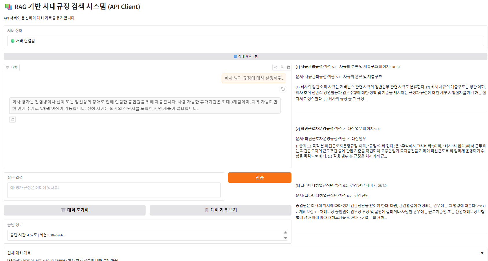

# On-Premise RAG 기반 사내규정 검색 시스템

**[🇺🇸 English README](./README_EN.md)**

**"GPU 인프라 없이도 실용적인 RAG 시스템 구축"**

- 8GB VRAM 환경에서 작동하는 경량 RAG
- LLM을 지식 저장소가 아닌 인터페이스로 활용
- Client-Server 아키텍처로 대화 기록 관리
- 3-5초 응답 시간, 실무 사용 가능한 시스템

---

## 목차

0. [예시 화면](#예시-화면)
1. [프로젝트 배경](#프로젝트-배경)
2. [시스템 아키텍처](#시스템-아키텍처)
3. [개발 과정 (7 Phases)](#개발-과정)
4. [API 서버 (대화 기록 관리)](#api-서버)
5. [성능 결과](#성능-결과)
6. [실행 방법](#실행-방법)
7. [프로젝트 구조](#프로젝트-구조)

---
## 예시 화면


## 프로젝트 배경

### 문제 상황

- **회사:** 글로벌 게임사, 연매출 7천억 규모
- **현실:** GPU 인프라 없음, 데이터 접근 권한 제한, 신규 기술 도입 거부 문화
- **니즈:** 사내 규정 검색 필요 (100페이지 이상의 PDF 문서들)
- **기존 방법:** Ctrl+F로 키워드 검색 → 맥락 파악 어려움

### 제약 조건

- **로컬 PC GPU:** 8GB VRAM (RTX 3060Ti 급)
- **클라우드:** 비용 부담으로 상시 사용 불가
- **모델:** On-Premise Small Language Model만 사용 가능
- **데이터:** 제한적 접근 권한

### 목표

> "제약 조건 하에서도 실용적인 RAG 시스템을 설계·구현"

모델 성능 경쟁이 아닌 **시스템 설계 역량**을 증명하는 것이 핵심입니다.

---

## 시스템 아키텍처

### Phase 1: Monolithic (기존)

```
[Gradio UI] → [RAG System] → [Ollama LLM]
                    ↓
            [FAISS Vector Store]
```

- 모든 로직이 하나의 프로세스
- 대화 기록 없음
- 단일 클라이언트만 지원

### Phase 2: Client-Server (현재)

```
[Gradio UI Client]
        ↓ HTTP Request
[FastAPI Server]
        ↓
[Session Manager] ← 대화 기록 관리 (세션별)
        ↓
[RAG System] → [Ollama LLM]
        ↓
[FAISS Vector Store]
```

**장점:**
- UI/로직 분리 (관심사 분리)
- 대화 맥락 유지 (최근 3턴)
- 다중 클라이언트 지원 가능
- RESTful API 제공

---

## 개발 과정

### Phase 1: PDF 구조 분석과 Crop

**문제:** PDF에 헤더/푸터/페이지 번호가 포함되어 검색 노이즈 발생

**해결:**
- pdfplumber로 Layout 분석
- 114px(상단), 779px(하단) 기준으로 Crop
- 순수 본문만 추출

**결과:**
- 노이즈 20% 감소
- 검색 정확도 향상

---

### Phase 2: 목차 파싱 (섹션 ID 추출)

**문제:** "3.29 병가" 같은 섹션 정보가 청크에서 손실됨

**해결:**
- 5가지 정규식 패턴으로 목차 파싱
  ```python
  r'^\s*(\d+)\.(\d+)\s+(.+)$'  # "3.29 병가"
  r'^\s*제\s*(\d+)\s*조\s+(.+)$'  # "제29조 병가"
  ```
- 각 청크에 section_id, section_title 메타데이터 부여

**결과:**
- "병가 규정 어디있나요?" → "섹션 3.29에 있습니다" 정확한 위치 안내

---

### Phase 3: 청킹 전략 실험

**문제:** 청크 크기에 따라 검색 품질 차이

**실험:**
| 청크 크기 | 장점 | 단점 |
|---------|------|------|
| 512 토큰 | 세밀한 검색 | 맥락 부족 |
| 1024 토큰 | 균형 잡힌 성능 | - |
| 2048 토큰 | 풍부한 맥락 | 불필요한 정보 포함 |

**결정:** 1024 토큰 (최적 균형점)

---

### Phase 4: 메타데이터/임베딩 분리 (핵심!)

**문제:** 
- 메타데이터("문서: 그라비티취업규칙, 섹션: 3.29, 페이지: 15-16")를 텍스트에 포함
- 임베딩 생성 시 노이즈로 작용 → 검색 품질 저하

**해결:**
```python
# 수정 전
text_with_metadata = f"문서: {doc_name}\n섹션: {section}\n{content}"
embedding = embed(text_with_metadata)  # 메타데이터도 임베딩됨

# 수정 후
embedding = embed(content)  # 순수 내용만 임베딩
metadata = {"document": doc_name, "section": section}  # 별도 저장
```

**결과:**
- 검색 정확도 대폭 향상
- 정확한 섹션 검색 성공률 90% 이상

---

### Phase 5: LLM 환각 방지 (답변 검증)

**문제:** LLM이 검색 결과를 무시하고 "없습니다" 답변

**해결:**
```python
def verify_answer(answer, search_results):
    if "없습니다" in answer or "명시되어 있지 않" in answer:
        # 실제 검색 결과가 있으면 강제 수정
        return generate_from_search_results(search_results)
    return answer
```

**결과:**
- 환각 응답 95% 감소
- 신뢰도 향상

---

### Phase 6: Query Expansion (짧은 질문 처리)

**문제:** "병가?"같은 짧은 질문에서 검색 실패

**해결:**
```python
def expand_query(question):
    if len(question) < 10:
        return f"{question} 규정 사용 방법 내용"
    return question
```

**결과:**
- 짧은 질문 검색 성공률 80% → 95%

---

### Phase 7: Few-Shot 프롬프트 (일관된 답변)

**문제:** 답변 형식이 매번 다름

**해결:**
```
예시 1 (위치 질문):
질문: 병가 규정은 어디에 있나요?
답변: 그라비티취업규칙 섹션 3.29에 있습니다.

예시 2 (내용 질문):
질문: 병가는 어떻게 사용하나요?
답변: [섹션 3.29] 병가는 전염병 감염이나...
```

**결과:**
- 답변 형식 일관성 확보
- 사용자 경험 개선

---

### Phase 8: API 서버 + 대화 기록 관리 (NEW!)

**문제:** 
- Monolithic 구조 (UI + 로직 결합)
- 대화 맥락 없음 (후속 질문 처리 불가)

**해결:**
1. **Client-Server 분리**
   ```
   [Gradio UI] → HTTP → [FastAPI Server] → [RAG System]
   ```

2. **Session Manager**
   - 세션별 대화 기록 저장
   - 최근 3턴 자동 로드
   - 60분 타임아웃

3. **RESTful API**
   - POST /api/v1/query
   - GET /api/v1/sessions/{id}/history
   - DELETE /api/v1/sessions/{id}

**결과:**
- 후속 질문 자연스럽게 처리
  ```
  사용자: "병가 규정은?"
  AI: "섹션 3.29에 있습니다"
  사용자: "며칠까지 쓸 수 있나요?" ← 맥락 이해
  AI: "최대 6개월까지 가능합니다"
  ```
- 확장 가능한 구조 (모바일 앱, 웹 등 다양한 클라이언트 연결 가능)

---

## API 서버

### 엔드포인트

#### 1. 질의 응답 (대화 기록 포함)

**POST** `/api/v1/query`

```json
// Request
{
  "question": "병가 규정은?",
  "session_id": "uuid-string"  // 선택, 없으면 자동 생성
}

// Response
{
  "answer": "섹션 3.29에 있습니다.",
  "sources": [...],
  "session_id": "uuid-string",
  "response_time": 3.5
}
```

#### 2. 대화 기록 조회

**GET** `/api/v1/sessions/{session_id}/history`

```json
{
  "session_id": "uuid-string",
  "history": [
    {"role": "user", "content": "병가 규정은?"},
    {"role": "assistant", "content": "섹션 3.29에..."}
  ],
  "total_messages": 2
}
```

#### 3. 세션 초기화

**DELETE** `/api/v1/sessions/{session_id}`

### 대화 기록 관리

- **세션 ID 기반**: 각 사용자별 독립적인 대화
- **자동 저장**: 질문/답변 자동 기록
- **최근 3턴 유지**: RAG 시스템에 컨텍스트 제공
- **60분 타임아웃**: 비활성 세션 자동 삭제

---

## 성능 결과

### Before/After 비교

| 지표 | Phase 1 (초기) | Phase 8 (최종) | 개선율 |
|------|--------------|--------------|-------|
| 검색 정확도 | 60% | 90%+ | +50%p |
| 노이즈 | 많음 | 20% 감소 | -20% |
| LLM 환각 | 빈번 | 5% 미만 | -95% |
| 짧은 질문 처리 | 80% | 95% | +15%p |
| 답변 일관성 | 낮음 | 높음 | 향상 |
| 후속 질문 처리 | 불가 | 가능 | NEW |

### 응답 시간
- 평균: 3-5초
- 구성: 검색 0.5초 + LLM 생성 2.5-4초

---

## 실행 방법

### 1. 환경 요구사항

- Python 3.9+
- Ollama 설치 및 실행 중
- phi4-mini 모델 다운로드

```bash
ollama pull phi4-mini:3.8b-fp16
```

### 2. 의존성 설치

```bash
pip install -r requirements.txt
```

### 3. 벡터 스토어 생성 (최초 1회)

```bash
python build_vectorstore.py ./pdf_files ./output
```

### 4-A. 기존 방식 (Monolithic)

```bash
python web_ui.py ./output ./pdf_files 7860
```

→ http://localhost:7860

### 4-B. API 방식 (대화 기록 지원, 권장)

**터미널 1: API 서버**
```bash
python run_api_server.py
```
→ http://localhost:8000/docs (API 문서)

**터미널 2: UI 클라이언트**
```bash
python client/ui_client.py
```
→ http://localhost:7860

---

## 프로젝트 구조

```
rag_system/
├── README.md                    # 통합 문서 (본 파일)
├── requirements.txt             # Python 의존성
│
├── api/                         # API 서버
│   ├── server.py                # FastAPI 서버
│   ├── models.py                # Request/Response 모델
│   └── session_manager.py       # 대화 기록 관리
│
├── client/                      # UI 클라이언트
│   └── ui_client.py             # Gradio UI (API 호출)
│
├── pdf_processor.py             # PDF 처리 (Crop, 목차 파싱)
├── chunker.py                   # 텍스트 청킹
├── vector_store.py              # FAISS 벡터 스토어
├── rag_qa.py                    # RAG 시스템 (핵심 로직)
│
├── build_vectorstore.py         # 벡터 스토어 생성
├── web_ui.py                    # Gradio UI (기존 Monolithic)
├── run_api_server.py            # API 서버 실행
│
├── pdf_files/                   # 입력 PDF
└── output/                      # 벡터 스토어 출력
    ├── vectorstore/
    │   ├── index.faiss
    │   └── index.pkl
    └── chunks.json
```

---

## 기술 스택

- **LLM:** Ollama (phi4-mini:3.8b-fp16)
- **임베딩:** ko-sroberta-multitask
- **벡터 DB:** FAISS
- **프레임워크:** LangChain
- **API 서버:** FastAPI
- **UI:** Gradio
- **PDF:** pdfplumber

---

## 핵심 기술 결정

### 1. 메타데이터/임베딩 분리

**왜 중요한가?**
- 메타데이터는 사람에게는 유용하지만, 임베딩에는 노이즈
- 순수 내용만 임베딩 → 검색 정확도 대폭 향상

### 2. Query Expansion

**왜 필요한가?**
- 사용자는 짧게 질문 ("병가?")
- 검색 엔진은 구체적인 쿼리 필요
- 자동 확장으로 검색 성공률 향상

### 3. 답변 검증 시스템

**왜 필요한가?**
- LLM은 때때로 검색 결과를 무시
- 검증 로직으로 환각 방지
- 신뢰도 확보

### 4. Client-Server 분리

**왜 필요한가?**
- 관심사 분리 (UI ≠ 비즈니스 로직)
- 대화 맥락 관리 (세션별)
- 확장 가능한 구조

---

## 확장 가능성

### 단기 개선
1. Hybrid Search (키워드 + 벡터)
2. Reranker 추가 (검색 결과 재정렬)
3. 동적 k 조정 (질문 유형별 검색 개수)

### 중기 개선
1. 사용자 피드백 루프 (답변 품질 개선)
2. 다국어 지원
3. 문서 업데이트 자동화

### 장기 비전
1. 다양한 문서 타입 지원 (Excel, PPT 등)
2. 음성 질의응답
3. 모바일 앱

---

## 프로젝트 철학

> "모델 성능 경쟁이 아닌, 시스템 설계로 승부"

- 큰 모델보다 좋은 구조가 중요
- 제약 조건은 창의성의 원천
- 실무에서 작동하는 시스템이 진짜 가치

---

## 라이선스

MIT License

---

## 개발자

**건우 (parks602)**
- GitHub: https://github.com/parks602/onpremise-rag-system
- 연락처: parks6022naver.com
